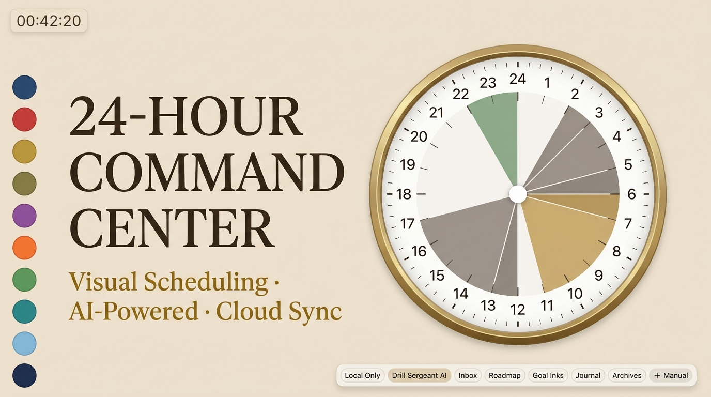
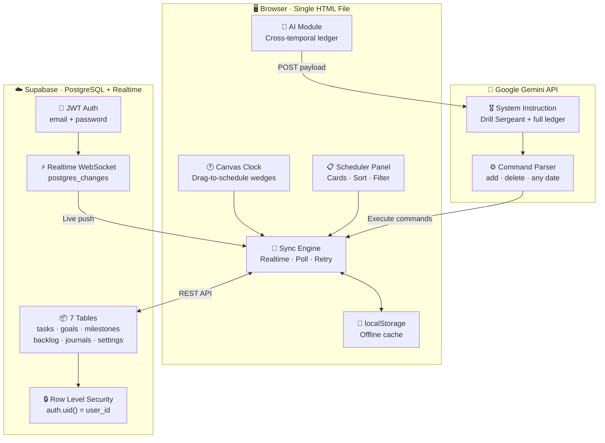

<!-- ══════════════════════════════════════════════════════════════ -->
<!--                    BANNER & HEADER                           -->
<!-- ══════════════════════════════════════════════════════════════ -->

<div align="center">



<br/><br/>

<!-- Typing SVG -->
<a href="https://git.io/typing-svg">
  
</a>

<br/><br/>

<!-- Tech Stack Badges -->
<p>
  
  
  
</p>
<p>
  
  
</p>

<!-- Project Stats Badges -->
<p>
  
  &nbsp;
  
  &nbsp;
  
  &nbsp;
  
  &nbsp;
  
</p>

<br/>

<!-- Quick Links -->
**[🚀 Quick Start](#️-getting-started)** &nbsp;•&nbsp;
**[✨ Features](#-features)** &nbsp;•&nbsp;
**[🏛️ Architecture](#️-system-architecture)** &nbsp;•&nbsp;
**[🗺️ Roadmap](#️-roadmap)** &nbsp;•&nbsp;
**[📖 Docs](#️-database-schema)**

<br/>

> 💬 *"The ledger is empty. Draw upon the clock face to begin."*

</div>

<br/>

---

<br/>

<!-- ══════════════════════════════════════════════════════════════ -->
<!--                    OVERVIEW                                   -->
<!-- ══════════════════════════════════════════════════════════════ -->

## 🔭 &nbsp; What Is This?

**24-Hour Command Center** is a **self-contained, single-file** productivity system for people who want to own every hour of their day — not just 9 to 5.

It replaces your calendar app with an **interactive 24-hour clock canvas** where tasks are painted as colored wedges. You drag an arc on the clock → a task is born. No clicking through menus. No friction.

<br/>

<div align="center">

|  | Capability |
|:---:|---|
| 🕐 | **Drag-to-schedule** on a full 24-hour analog clock |
| 🤖 | **Drill Sergeant AI** powered by Gemini — reads your full history, adds/deletes tasks by voice command |
| ☁️ | **Real-time sync** across every device via Supabase Realtime |
| 📊 | **30-day performance analytics** with heatmap, discipline rate, and goal breakdown |
| 📝 | **Dual journal** — daily routine log + long-term master strategy |
| 📥 | **Idea Inbox** — capture ideas now, schedule them later |
| 🎯 | **Master Goals + Roadmap** — link every task to a goal with milestone tracking |
| 💾 | **Local-first** — works 100% offline in `localStorage`, cloud is optional |

</div>

<br/>

> [!NOTE]
> The **entire application** — all HTML, all CSS, all JavaScript — lives inside a single file: **`command-center.html`**.
> No npm. No build step. No server. Open and use.

<br/>

---

<br/>

<!-- ══════════════════════════════════════════════════════════════ -->
<!--                    DEMO / SCREENSHOT                          -->
<!-- ══════════════════════════════════════════════════════════════ -->

## 🖥️ &nbsp; App Preview

<div align="center">

> **Add your own screenshot here** — press `F12 → More Tools → Capture Screenshot` in Chrome  
> then save as `assets/screenshot.png` and it will appear below.

| 🕐 Clock Canvas | 📋 Task Panel |
|:---:|:---:|
| Drag an arc to schedule | Cards sorted by time or goal |

</div>

<br/>

---

<br/>

<!-- ══════════════════════════════════════════════════════════════ -->
<!--                    ARCHITECTURE                               -->
<!-- ══════════════════════════════════════════════════════════════ -->

## 🏛️ &nbsp; System Architecture



<br/>

---

<br/>

<!-- ══════════════════════════════════════════════════════════════ -->
<!--                    FEATURES                                   -->
<!-- ══════════════════════════════════════════════════════════════ -->

## ✨ &nbsp; Features

<br/>

<details open>
<summary>
  <h3>🕐 &nbsp; Interactive 24-Hour Clock Canvas</h3>
</summary>

<br/>

> The core UI. A full 24-hour analog clock rendered in **HTML5 Canvas 2D API** — interactive, live, pixel-sharp on all screens.

<br/>

| 🔧 Capability | 📋 Description |
|---|---|
| **Drag-to-schedule** | Click and drag an arc on the clock face → task modal pre-fills start & end times automatically |
| **Task wedges** | Every task paints a colored arc on the dial — your day becomes a visual pie chart |
| **Goal Ink Colors** | Each Master Goal has an assigned color — tasks inherit it on both the clock and the list |
| **Live time hand** | A red needle points to the exact current time (shown on today's date only) |
| **HiDPI / Retina** | Canvas scales with `window.devicePixelRatio` — crisp on all displays |
| **Full 24h coverage** | Midnight to midnight — no productivity lost to a 12-hour bias |

<br/>

</details>

---

<details>
<summary>
  <h3>🤖 &nbsp; Drill Sergeant AI Advisor</h3>
</summary>

<br/>

> Powered by **Google Gemini**. Not a passive chatbot — it reads your full scheduling history and can modify any date on command.

<br/>

| 🔧 Capability | 📋 Description |
|---|---|
| **Cross-temporal awareness** | AI receives a complete structured dump of every task on **every date** — not just today |
| **Natural language commands** | *"Add a deep work block tomorrow 09:00–12:00"* → executed instantly |
| **Structured command protocol** | Responses embed a JSON block between `===COMMANDS_BEGIN===` delimiters — parsed and applied client-side |
| **Cloud push** | AI-issued mutations hit Supabase in real time if connected |
| **Multi-model support** | Gemini 3.6 Flash · 3.5 Flash-Lite · 3.1 Pro · 2.5 Flash · any custom model ID |
| **Rate-limited ledger pull** | Full-history fetch capped at 1× per 60 seconds |

<br/>

**How it works under the hood:**

```
User message
    ↓
Build payload:
  system_instruction = Drill Sergeant persona
                     + all tasks across all dates (with IDs)
                     + command format spec
  contents = chat history + new message
    ↓
POST → Gemini API
    ↓
Parse response for ===COMMANDS_BEGIN=== block
    ↓
For each command → add task / delete task → Supabase → re-render
```

<br/>

</details>

---

<details>
<summary>
  <h3>☁️ &nbsp; Real-Time Cloud Sync</h3>
</summary>

<br/>

> Optional. Free. Secure. Your data — your Supabase project.

<br/>

| 🔧 Capability | 📋 Description |
|---|---|
| **Supabase Realtime** | `postgres_changes` WebSocket — changes appear on all devices within seconds |
| **45-second polling fallback** | Runs in the background if Realtime isn't enabled on your project |
| **Offline resilience** | Detects `navigator.onLine` · marks edits `_unsynced` · retries on reconnect |
| **Unsynced badge** | Tasks pending upload show a visible `Not Synced` flag |
| **One-click migration** | Import all localStorage data to cloud with a single button |
| **Session persistence** | Auth token in localStorage → session auto-restores on revisit |
| **Row Level Security** | Every table enforces `auth.uid() = user_id` — your data is invisible to all other users |

<br/>

> [!IMPORTANT]
> Cloud sync is **fully optional**. The app is 100% functional offline via `localStorage`. You can connect Supabase at any time without losing a single task.

<br/>

</details>

---

<details>
<summary>
  <h3>📋 &nbsp; Task Management</h3>
</summary>

<br/>

Every task is a rich object:

```
task = {
  label       : "Deep Work — Trading Algorithm",
  goal        : "Algorithmic Trading System",
  start_time  : "09:00",
  end_time    : "12:00",
  color       : "#4a6984",          ← or auto from goal ink
  notes       : "Focus on backtesting engine...",
  subtasks    : [{ text, done }, ...],
  completed   : false,
  review      : "Edge case missed at hour 2...",  ← retrospective
}
```

<br/>

| 🔧 Feature | 📋 Description |
|---|---|
| **Subtask progress bar** | Visual `%` bar shows completion across all subtask checkboxes |
| **Auto-cascade completion** | All subtasks done → parent auto-completes. Parent toggled → all subtasks follow |
| **Retrospective field** | Post-task review note for learning from execution failures |
| **Sort modes** | `Sort by Time` or `Group by Goal` — togglable instantly |
| **Idea Inbox** | Slide-in drawer — capture ideas without scheduling, then promote them to tasks with one click |

<br/>

</details>

---

<details>
<summary>
  <h3>📊 &nbsp; Archives & Analytics</h3>
</summary>

<br/>

<div align="center">

| 📈 Metric | 🧮 Formula |
|:---:|:---:|
| Hours Planned | Total scheduled time — last 30 days |
| Hours Executed | Completed task time — last 30 days |
| **Discipline Rate** | `(Executed ÷ Planned) × 100%` |
| Active Days | Days with ≥ 1 task in window |

</div>

<br/>

**Additional analytics:**

- 🔥 **Effort Heatmap** — GitHub-style 30-day rolling grid (5 intensity levels)
- 🎯 **Goal Time Allocation** — hours + % share per Master Goal
- 📋 **Performance Report** — one-click clipboard copy as plain text
- 📥 **CSV Export** — all tasks, all dates · BOM-prefixed for Excel compatibility
- 💾 **JSON Backup** — full export of tasks, journals, milestones, backlog, goals

<br/>

</details>

<br/>

---

<br/>

<!-- ══════════════════════════════════════════════════════════════ -->
<!--                    TECH STACK                                 -->
<!-- ══════════════════════════════════════════════════════════════ -->

## 🛠️ &nbsp; Technology Stack

<br/>

<div align="center">

| Layer | Technology | Why |
|:---:|:---:|:---:|
| **Rendering** | HTML5 Canvas 2D | Clock · wedges · time hand · HiDPI |
| **Logic** | Vanilla JS ES2022 | Zero framework — maximum portability |
| **Styling** | Vanilla CSS + Custom Props | Parchment/brass design system |
| **Local Storage** | `localStorage` + memory fallback | Offline-first, zero config |
| **Cloud DB** | Supabase PostgreSQL | Hosted · free tier · open source |
| **Realtime** | Supabase `postgres_changes` | WebSocket live cross-device push |
| **Auth** | Supabase Auth | JWT · auto-refresh · per-user RLS |
| **AI** | Google Gemini REST | `generateContent` v1beta endpoint |
| **Deploy** | Static HTML | GitHub Pages · Netlify · any CDN |

</div>

<br/>

---

<br/>

<!-- ══════════════════════════════════════════════════════════════ -->
<!--                    GETTING STARTED                            -->
<!-- ══════════════════════════════════════════════════════════════ -->

## ⚙️ &nbsp; Getting Started

<br/>

### ① &nbsp; Local — Zero Setup

```bash
# Clone
git clone https://github.com/afrojkhan6033/command_center.git
cd command_center
```

Then open **`command-center.html`** in your browser. Done.

> [!TIP]
> For persistent `localStorage`, use a local server:
> ```bash
> npx serve .                 # Node.js
> python -m http.server 8080  # Python 3
> ```
> Open → `http://localhost:8080/command-center.html`

<br/>

---

### ② &nbsp; Cloud Sync (Supabase)

<details>
<summary><strong>Expand setup steps →</strong></summary>

<br/>

**1. Create a free Supabase project**
- Go to [supabase.com](https://supabase.com) → Sign up → **New Project**
- Wait ~2 minutes for provisioning

**2. Run the schema**
- Open **SQL Editor → New Query** in your dashboard
- Paste the contents of [`schema.sql`](./schema.sql) → **Run**
- Expected: `Success. No rows returned.`

**3. Copy your credentials**
- Go to **Project Settings → API**
- Copy: **Project URL** + **anon public key**

**4. Connect in the app**
- Click **☁ Cloud Sync** → paste URL + key → **Connect**
- Create an account → sign in
- Existing local data? Click **⬆ Import local data to cloud**

> 📖 Full walkthrough: [`SETUP_GUIDE.md`](./SETUP_GUIDE.md)

</details>

<br/>

---

### ③ &nbsp; AI Advisor (Gemini)

<details>
<summary><strong>Expand setup steps →</strong></summary>

<br/>

**1. Get a free API key** → [aistudio.google.com/apikey](https://aistudio.google.com/apikey)

**2. Enter it in the app**
→ Click **🤖 Drill Sergeant AI** → **⚙ Settings** → paste key → choose model → **Save**

<br/>

| Model | Speed | Best For |
|---|:---:|---|
| `gemini-3.6-flash` ⭐ | Fast | Best all-around — recommended |
| `gemini-3.5-flash-lite` | Fastest | Cost-sensitive usage |
| `gemini-3.1-pro` | Moderate | Complex multi-step reasoning |
| `gemini-2.5-flash` | Fast | Legacy compatibility |
| Custom model ID | — | Any Gemini model string |

</details>

<br/>

---

### ④ &nbsp; Host on GitHub Pages

<details>
<summary><strong>Expand steps →</strong></summary>

<br/>

1. Push this repo to GitHub
2. **Settings → Pages → Source: main / root → Save**
3. Live at:
   ```
   https://afrojkhan6033.github.io/command_center/command-center.html
   ```
4. **Pro tip:** Rename to `index.html` → cleaner URL:
   ```
   https://afrojkhan6033.github.io/command_center/
   ```

Once hosted, open on any device, sign into Supabase — all data is there instantly.

</details>

<br/>

---

<br/>

<!-- ══════════════════════════════════════════════════════════════ -->
<!--                    DATABASE SCHEMA                            -->
<!-- ══════════════════════════════════════════════════════════════ -->

## 🗄️ &nbsp; Database Schema

<br/>

Seven PostgreSQL tables — all under Row Level Security (`auth.uid() = user_id`):

<br/>

<div align="center">

| Table | Purpose | PK |
|:---:|:---:|:---:|
| `tasks` | Scheduled time blocks | `bigint` identity |
| `goals` | Master goals + ink colors | `bigint` identity |
| `milestones` | Roadmap items per goal | `bigint` identity |
| `backlog_items` | Unscheduled idea inbox | `bigint` identity |
| `daily_journals` | Per-date free-text entries | `(user_id, date)` |
| `master_journal` | Long-form strategy document | `user_id` |
| `user_settings` | Gemini key + model choice | `user_id` |

</div>

<br/>

<details>
<summary><strong>Key design decisions</strong></summary>

<br/>

- `tasks.subtasks` → stored as `jsonb` (`[{ text, done }]`) — no separate join table needed
- `tasks.start_time` / `end_time` → `"HH:MM"` strings; converted to/from canvas arc angles client-side
- `updated_at` → auto-maintained via shared `set_updated_at()` PL/pgSQL trigger on all tables
- All 6 data tables subscribed to **Supabase Realtime** for live cross-device push

Full annotated schema: [`schema.sql`](./schema.sql)

</details>

<br/>

---

<br/>

<!-- ══════════════════════════════════════════════════════════════ -->
<!--                    DATA FLOW                                  -->
<!-- ══════════════════════════════════════════════════════════════ -->

## 🔄 &nbsp; Data Flow & Sync Strategy

<br/>

> **Architecture:** Local-first · Cloud-backed · Offline-resilient

<br/>

```
WRITE
──────────────────────────────────────────────────────────────────
  User action
    → localStorage  (immediate · synchronous)
    → Supabase REST (async)
          ↳ on failure  → mark _unsynced = true
                        → retry on Sync Now or reconnect

READ  (on date change)
──────────────────────────────────────────────────────────────────
  Render from localStorage immediately
    → Pull from Supabase for selected date
        → Merge (cloud wins · unsynced locals preserved)
            → Re-render

REALTIME  (while signed in)
──────────────────────────────────────────────────────────────────
  Supabase push → local merge → re-render if date matches
```

<br/>

<details>
<summary><strong>All sync triggers</strong></summary>

<br/>

| Trigger | Action |
|---|---|
| Date change | Pull tasks for the new date |
| Sign in | Full global pull (goals · milestones · backlog · journals · settings) |
| Manual **Sync Now** | Full pull + retry unsynced queue |
| Task create / edit / delete | Immediate REST push |
| Realtime event | Immediate merge + conditional re-render |
| Every 45 seconds | Background pull for current date |
| Open AI modal | Full-history pull (throttled: 1× per 60s) |
| Browser comes online | Triggers `manualSyncNow()` |

</details>

<br/>

---

<br/>

<!-- ══════════════════════════════════════════════════════════════ -->
<!--                    PROJECT STRUCTURE                          -->
<!-- ══════════════════════════════════════════════════════════════ -->

## 📁 &nbsp; Project Structure

```
📦 command_center/
│
├── 🌐 command-center.html   ← The entire application (HTML + CSS + JS · ~127KB · ~1,985 lines)
├── 🗄️  schema.sql            ← Supabase schema (7 tables · RLS policies · Realtime · triggers)
├── 📖 SETUP_GUIDE.md        ← Step-by-step cloud sync setup
├── 🖼️  assets/
│   └── banner.jpg           ← README header banner
└── 📄 README.md             ← This file
```

<br/>

**Why a single file?**
- ✅ Open from a USB drive — no install
- ✅ Share via email as an attachment
- ✅ GitHub Pages deploy with zero config
- ✅ Works on any PC with just a browser
- ✅ Version control is trivially simple — diff one file

<br/>

---

<br/>

<!-- ══════════════════════════════════════════════════════════════ -->
<!--                    ROADMAP                                    -->
<!-- ══════════════════════════════════════════════════════════════ -->

## 🗺️ &nbsp; Roadmap

<br/>

<div align="center">

| Status | Feature |
|:---:|---|
| ✅ | Interactive 24h clock canvas with drag-to-schedule |
| ✅ | Supabase real-time cloud sync + auth |
| ✅ | Cross-temporal Drill Sergeant AI (Gemini) |
| ✅ | Master Goals + Goal Ink color system |
| ✅ | Subtasks with live progress bars |
| ✅ | Daily + Master Journal (dual-tab) |
| ✅ | Strategic Roadmap with milestones + progress bar |
| ✅ | 30-day heatmap + performance analytics |
| ✅ | CSV + JSON export |
| ✅ | Offline resilience with unsynced retry queue |
| 🔜 | Week view (7-day calendar overlay) |
| 🔜 | Recurring task templates (daily / weekly) |
| 🔜 | Mobile touch support (pinch-zoom clock) |
| 🔜 | AI-generated weekly performance summaries |
| 🔜 | Dark mode toggle |
| 🔜 | Shared workspaces (multi-user collaboration) |
| 🔜 | Web Push notifications |
| 🔜 | Google Calendar import |

</div>

<br/>

---

<br/>

<!-- ══════════════════════════════════════════════════════════════ -->
<!--                    PERFORMANCE                                -->
<!-- ══════════════════════════════════════════════════════════════ -->

## ⚡ &nbsp; Performance & Constraints

<br/>

<div align="center">

| Metric | Value |
|:---:|:---:|
| **Bundle size** | ~127 KB — one file |
| **External CDN** | 1 (Supabase JS v2 from jsDelivr) |
| **npm dependencies** | 0 |
| **Build step** | None |
| **Offline support** | ✅ Full |
| **HiDPI / Retina** | ✅ Full |
| **Supabase free tier** | 500MB DB · 2GB bandwidth/mo |
| **Gemini free tier** | 15 req/min (Flash models) |
| **Min. browser** | Chrome 88 · Firefox 98 · Safari 15.4 · Edge 88 |

</div>

<br/>

---

<br/>

<!-- ══════════════════════════════════════════════════════════════ -->
<!--                    KNOWN ISSUES                               -->
<!-- ══════════════════════════════════════════════════════════════ -->

## 🐛 &nbsp; Known Issues

<br/>

| ⚠️ Issue | ✅ Workaround |
|---|---|
| `localStorage` blocked in strict privacy / incognito modes | Serve via local HTTP server or host online |
| Gemini API key transmitted client-side | Personal keys only — sent exclusively to Google's official endpoint |
| AI command parsing fails on non-standard model responses | Clear chat memory and rephrase the request |
| Supabase Realtime disabled by default on new projects | Enable: Dashboard → Database → Replication; 45s polling covers the gap |
| `<dialog>` unsupported in Safari < 15.4 | Update Safari or switch to Chrome / Firefox / Edge |
| CSV date column auto-formatted by Excel | Handled — uses `="YYYY-MM-DD"` Excel escape prefix in export |

<br/>

---

<br/>

<!-- ══════════════════════════════════════════════════════════════ -->
<!--                    AUTHOR                                     -->
<!-- ══════════════════════════════════════════════════════════════ -->

## 👤 &nbsp; Author

<br/>

<div align="center">


<br/><br/>

**afrojkhan6033**

[](https://github.com/afrojkhan6033)

</div>

<br/>

---

<br/>

<!-- ══════════════════════════════════════════════════════════════ -->
<!--                    LICENSE                                    -->
<!-- ══════════════════════════════════════════════════════════════ -->

## ⚠️ &nbsp; License

<div align="center">

**All Rights Reserved © 2026 afrojkhan6033**

This software and its source code are the exclusive intellectual property of the author.  
No part may be copied, modified, distributed, sublicensed, or sold  
without explicit written permission.

</div>

<br/>

---

<!-- FOOTER -->
<div align="center">


<br/>

*Built with precision. Maintained with discipline.*

⭐ **If this project helped you — drop a star. It costs nothing and means everything.**

</div>
