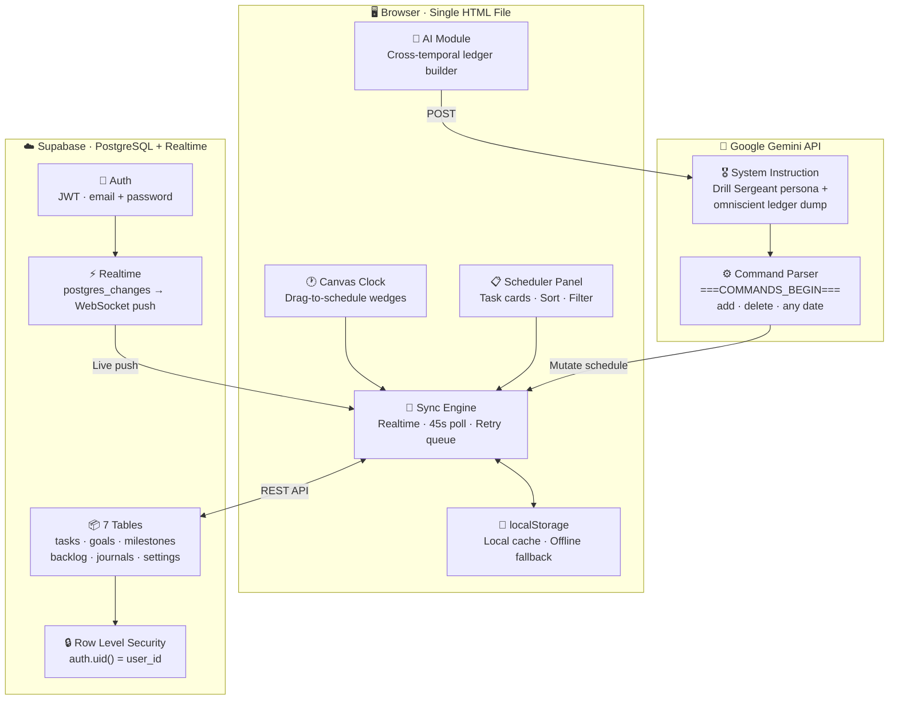

<div align="center">


<br/>

<!-- Badges -->
<p>
  
  &nbsp;
  
  &nbsp;
  
  &nbsp;
  
  &nbsp;
  
  &nbsp;
  
</p>

<p>
  
  &nbsp;
  
  &nbsp;
  
  &nbsp;
  
</p>

<br/>

<blockquote>
  <em>"The ledger is empty. Draw upon the clock face to begin."</em>
</blockquote>

<br/>

**[📖 Documentation](#-overview) · [⚙️ Setup](#️-getting-started) · [🗺️ Roadmap](#️-roadmap) · [🐛 Issues](#-known-issues)**

</div>

<br/>

---

<br/>

## 📑 Table of Contents

<details open>
<summary><strong>Click to expand</strong></summary>

<br/>

- [🔭 Overview](#-overview)
- [🏛️ System Architecture](#️-system-architecture)
- [✨ Features](#-features)
  - [🕐 24-Hour Clock Canvas](#-24-hour-clock-canvas)
  - [🤖 Drill Sergeant AI](#-drill-sergeant-ai-advisor)
  - [☁️ Real-Time Cloud Sync](#️-real-time-cloud-sync)
  - [📋 Task Management](#-task-management)
  - [📊 Archives & Analytics](#-archives--analytics)
- [🛠️ Technology Stack](#️-technology-stack)
- [⚙️ Getting Started](#️-getting-started)
- [🗄️ Database Schema](#️-database-schema)
- [🔄 Data Flow & Sync](#-data-flow--sync-strategy)
- [📁 Project Structure](#-project-structure)
- [🗺️ Roadmap](#️-roadmap)
- [⚡ Performance](#-performance--constraints)
- [🐛 Known Issues](#-known-issues)
- [👤 Author](#-author)

</details>

<br/>

---

<br/>

## 🔭 Overview

<div align="center">

| 🕐 Visual Scheduling | 🤖 AI-Powered | ☁️ Cross-Device Sync | 📊 Analytics |
|:---:|:---:|:---:|:---:|
| 24-hour drag-to-schedule clock canvas | Gemini-powered drill sergeant AI that reads and modifies your entire schedule | Real-time Supabase sync across every device you own | 30-day heatmap, discipline rate, and goal time allocation |

</div>

<br/>

The **24-Hour Command Center** is a **single-file, zero-dependency** productivity system for high-discipline individuals who need to account for every hour of the day — not just 9 to 5.

Instead of a traditional list or calendar, tasks are plotted as **colored wedges on a 24-hour clock dial**, giving an instant, unambiguous picture of how the entire day is structured. The clock is interactive — drag an arc to schedule a task in seconds.

When connected to [Supabase](https://supabase.com), every piece of data syncs to the cloud in real time across all your devices. Without a connection, the app works perfectly in **Local-Only mode** using `localStorage`.

<br/>

> [!NOTE]
> The entire application — all HTML, CSS, and JavaScript — lives inside **one single file**: `command-center.html`. No npm. No build. No server. Just open and use.

<br/>

---

<br/>

## 🏛️ System Architecture



<br/>

---

<br/>

## ✨ Features

<br/>

### 🕐 24-Hour Clock Canvas

> The core of the app. A full 24-hour analog clock rendered in HTML5 Canvas — interactive, live, and beautiful.

<br/>

| Capability | Detail |
|---|---|
| **Drag-to-schedule** | Drag a wedge arc on the clock face → task modal opens with times pre-filled |
| **Task wedges** | Each task paints a colored arc on the dial |
| **Goal Ink Colors** | Tasks auto-inherit their goal's color across the clock *and* list |
| **Live time hand** | Red indicator hand points to the current time (today's view only) |
| **HiDPI / Retina** | Canvas scales with `window.devicePixelRatio` — crisp on all screens |
| **Full 24h coverage** | Midnight to midnight — no 9-to-5 bias |

<br/>

---

<br/>

### 🤖 Drill Sergeant AI Advisor

> Powered by Google Gemini. Omniscient. Unforgiving. Effective.

<br/>

The AI is not a passive chatbot. It receives your **entire scheduling history across all dates** and can **add or delete tasks on any date** — past, present, or future — by natural language command.

<br/>

| Capability | Detail |
|---|---|
| **Cross-temporal awareness** | AI gets a structured dump of every task on every date — not just today |
| **Natural language scheduling** | *"Add a deep work block tomorrow from 9 to 12"* — done |
| **Structured command protocol** | Responses embed a JSON command array between `===COMMANDS_BEGIN===` delimiters — parsed and applied instantly |
| **Immediate cloud push** | AI-issued mutations hit Supabase in real time if cloud is connected |
| **Model choice** | Gemini 3.6 Flash · 3.5 Flash-Lite · 3.1 Pro · 2.5 Flash · or any custom model ID |
| **Throttled history pull** | Full-ledger re-fetch is rate-limited to 1× per 60 seconds |
| **Clearable memory** | Chat history lives in-session and can be wiped on demand |

<br/>

<details>
<summary>📐 <strong>How the AI command protocol works</strong></summary>

<br/>

The AI parses your message, checks its omniscient ledger, then appends a JSON command block to its response if any schedule changes are needed:

```
┌──────────────────────────────────────────────────────────┐
│                   Gemini API Payload                     │
│                                                          │
│  system_instruction:                                     │
│    · Drill Sergeant persona                              │
│    · Current app date + real-world today                 │
│    · User's master goals                                 │
│    · ALL tasks across ALL dates (with IDs)               │
│    · Command format spec                                 │
│                                                          │
│  contents: [ ...chat history, new user message ]         │
└──────────────────────────────────────────────────────────┘
                          │
             ─────────────┴─────────────
             │                         │
     Has command block?          No commands
     Parse JSON array            Show text in chat
             │
    ┌────────┴────────┐
    │                 │
  "add"           "delete"
  Create task     Find by ID
  → Supabase      Delete + Supabase
  → Re-render     → Re-render
```

</details>

<br/>

---

<br/>

### ☁️ Real-Time Cloud Sync

> Optional. Free. Secure. Works across every device you own.

<br/>

| Capability | Detail |
|---|---|
| **Supabase Realtime** | Subscribes to `postgres_changes` — changes appear on other devices within seconds |
| **45-second polling fallback** | Runs in the background if Realtime is not enabled on your project |
| **Offline resilience** | Detects `navigator.onLine` · marks edits `_unsynced` · retries automatically on reconnect |
| **Unsynced visual flag** | Tasks that haven't reached the server show a `Not Synced` badge |
| **One-click migration** | Import all existing localStorage data to the cloud with a single button |
| **Session persistence** | Auth token stored in localStorage — session restores automatically on revisit |
| **Row Level Security** | `auth.uid() = user_id` enforced on every table — your data is invisible to everyone else |

<br/>

> [!IMPORTANT]
> Cloud sync is **entirely optional**. The app is fully functional in Local-Only mode using `localStorage`. You can connect Supabase at any time without losing any existing local data.

<br/>

---

<br/>

### 📋 Task Management

<br/>

| Field | Description |
|---|---|
| **Title** | Session focus / task name |
| **Time range** | Start + end time (24-hour) — set by drag or manual input |
| **Goal tag** | Links task to a Master Goal |
| **Color ink** | 10 palette swatches or auto-inherited from goal color |
| **Notes** | Free-text context and objectives |
| **Subtasks** | Checklist steps with individual checkboxes |
| **Progress bar** | Visual % of subtasks completed |
| **Auto-cascade** | Marking all subtasks done → parent task auto-completes |
| **Retrospective** | Per-task post-mortem notes after execution |
| **Completion state** | Checkbox toggle — dims the task card and wedge on clock |

<br/>

**View modes:** `Sort by Time` · `Group by Goal`

**Idea Inbox:** Slide-in drawer to capture unscheduled ideas → link to goals → promote to scheduled tasks with one click.

<br/>

---

<br/>

### 📊 Archives & Analytics

<br/>

<div align="center">

| 📈 Metric | 🧮 How It's Calculated |
|:---:|:---:|
| **Hours Planned** | Total scheduled time — last 30 days |
| **Hours Executed** | Completed task time — last 30 days |
| **Discipline Rate** | `(Executed ÷ Planned) × 100` |
| **Active Days** | Days with ≥ 1 task — last 30 days |

</div>

<br/>

- 🔥 **Effort Heatmap** — GitHub-style 30-day grid (5 intensity levels: 0–2h · 2–5h · 5–8h · 8h+)
- 🎯 **Goal Time Allocation** — Hours and % share per Master Goal
- 📋 **Performance Report** — One-click clipboard copy as plain text
- 📥 **CSV Export** — All tasks, all dates · Excel-safe BOM-prefixed UTF-8
- 💾 **JSON Backup** — Full data export: tasks, journals, milestones, backlog, goals, colors

<br/>

---

<br/>

## 🛠️ Technology Stack

<br/>

<div align="center">

| Layer | Technology | Role |
|:---:|:---:|:---:|
| **Rendering** | HTML5 Canvas 2D API | Clock face · wedge drawing · time hand |
| **Logic** | Vanilla JavaScript ES2022 | No framework · no build step |
| **Styling** | Vanilla CSS + Custom Properties | Parchment / brass design system |
| **Local Storage** | `localStorage` + in-memory fallback | Offline-first persistence |
| **Cloud DB** | Supabase (PostgreSQL) | Hosted database — free tier |
| **Realtime** | Supabase `postgres_changes` | WebSocket live sync |
| **Auth** | Supabase Auth | JWT · email + password · RLS |
| **AI** | Google Gemini REST API | `generateContent` v1beta |
| **Deploy** | Static HTML file | GitHub Pages · Netlify · any CDN |

</div>

<br/>

---

<br/>

## ⚙️ Getting Started

<br/>

### 1️⃣ &nbsp; Local Usage — Zero Setup

```bash
# Clone
git clone https://github.com/afrojkhan6033/command_center.git
cd command_center

# Open in browser (Windows)
start command-center.html

# Open in browser (macOS)
open command-center.html

# Open in browser (Linux)
xdg-open command-center.html
```

> [!TIP]
> For reliable `localStorage` persistence, serve via a local HTTP server:
> ```bash
> npx serve .                  # Node.js
> python -m http.server 8080   # Python 3
> ```
> Then open → `http://localhost:8080/command-center.html`

<br/>

---

<br/>

### 2️⃣ &nbsp; Cloud Sync Setup (Supabase)

<details>
<summary>Click to expand full setup steps</summary>

<br/>

**Step 1 — Create a free Supabase project**

1. Go to [supabase.com](https://supabase.com) → Sign up → **New Project**
2. Choose any name and region
3. Wait ~2 minutes for provisioning

<br/>

**Step 2 — Run the database schema**

1. Open **SQL Editor → New Query** in your Supabase dashboard
2. Copy the contents of [`schema.sql`](./schema.sql) → paste → **Run**
3. Expected: `Success. No rows returned.`

<br/>

**Step 3 — Get your credentials**

Go to **Project Settings → API** and copy:
- ✅ **Project URL** — `https://xxxxxxxx.supabase.co`
- ✅ **anon public key** — `eyJ...`

<br/>

**Step 4 — Connect in the app**

1. Open the app → click **☁ Cloud Sync**
2. Paste the URL + key → **Connect**
3. Create an account (email + password) right inside the app
4. If you have existing local data → click **⬆ Import local data to cloud**

<br/>

> Full walkthrough with screenshots: [`SETUP_GUIDE.md`](./SETUP_GUIDE.md)

</details>

<br/>

---

<br/>

### 3️⃣ &nbsp; AI Advisor Setup (Gemini)

<details>
<summary>Click to expand setup steps</summary>

<br/>

**Step 1 — Get a free API key**

→ Visit [aistudio.google.com/apikey](https://aistudio.google.com/apikey) → Sign in → **Create API Key**

<br/>

**Step 2 — Enter it in the app**

Click **🤖 Drill Sergeant AI** → **⚙ Settings** → paste key → choose model → **Save**

<br/>

| Model | Best For |
|---|---|
| `gemini-3.6-flash` ⭐ *default* | Best balance of speed and intelligence |
| `gemini-3.5-flash-lite` | Fastest — lowest cost |
| `gemini-3.1-pro` | Strongest multi-step reasoning |
| `gemini-2.5-flash` | Legacy compatibility |
| Custom model ID | Any valid Gemini model string |

<br/>

> [!NOTE]
> Your API key is stored **only in your own localStorage** and optionally in your own Supabase `user_settings` table (protected by RLS). It is never sent anywhere except Google's official API endpoint.

</details>

<br/>

---

<br/>

### 4️⃣ &nbsp; Host on GitHub Pages (Any Device Access)

<details>
<summary>Click to expand</summary>

<br/>

1. Push the repo to GitHub
2. **Settings → Pages → Source → main / root → Save**
3. Your app is live at:

```
https://afrojkhan6033.github.io/command_center/command-center.html
```

> **Pro tip:** Rename `command-center.html` → `index.html` for a cleaner URL:
> ```
> https://afrojkhan6033.github.io/command_center/
> ```

Once hosted + Supabase connected, open it on any device, sign in, and everything syncs automatically.

</details>

<br/>

---

<br/>

## 🗄️ Database Schema

<br/>

Seven PostgreSQL tables — all protected by Row Level Security:

<br/>

| Table | Purpose | Primary Key |
|---|---|---|
| `tasks` | Scheduled time blocks | `bigint` identity |
| `goals` | Master goals + ink colors | `bigint` identity |
| `milestones` | Roadmap items per goal | `bigint` identity |
| `backlog_items` | Unscheduled ideas / Inbox | `bigint` identity |
| `daily_journals` | Per-date journal entries | `(user_id, date)` composite |
| `master_journal` | Long-form strategy document | `user_id` (one row per user) |
| `user_settings` | Gemini key + model preference | `user_id` (one row per user) |

<br/>

<details>
<summary>📐 <strong>Key design decisions</strong></summary>

<br/>

- `tasks.subtasks` → stored as `jsonb` (`[{ text, done }]`) — avoids a separate join table
- `tasks.start_time` / `end_time` → stored as `"HH:MM"` strings; converted to/from canvas arc angles client-side
- `updated_at` → auto-maintained on all tables via a shared `set_updated_at()` PL/pgSQL trigger
- All tables subscribe to **Supabase Realtime** for live cross-device push

Full annotated schema: [`schema.sql`](./schema.sql)

</details>

<br/>

---

<br/>

## 🔄 Data Flow & Sync Strategy

<br/>

> **Architecture:** Local-first · Cloud-backed · Offline-resilient

<br/>

```
WRITE
─────────────────────────────────────────────────────
User action
  → localStorage (immediate · synchronous)
  → Supabase REST (async)
       ↳ on failure → mark _unsynced = true
                    → retry on Sync Now or reconnect

READ  (on date change)
─────────────────────────────────────────────────────
Render from localStorage cache immediately
  → Pull from Supabase for selected date
      → Merge  (cloud wins · unsynced locals preserved)
          → Re-render

REALTIME  (while signed in)
─────────────────────────────────────────────────────
Supabase push → merge into tasksByDate → re-render if date matches
```

<br/>

<details>
<summary>📋 <strong>All sync triggers</strong></summary>

<br/>

| Trigger | Action |
|---|---|
| Date change | Pull tasks for the new date from cloud |
| Sign in | Full global data pull (goals · milestones · backlog · journals · settings) |
| Manual **Sync Now** | Full pull + unsynced queue retry |
| Task create / edit / delete | Immediate REST push |
| Realtime event | Immediate local merge + conditional re-render |
| Every 45 seconds | Background pull for current date (polling fallback) |
| Open AI modal | Full-history pull — throttled to 1× per 60 seconds |
| Browser comes back online | Triggers `manualSyncNow()` |

</details>

<br/>

---

<br/>

## 📁 Project Structure

<br/>

```
📦 project_sheduler/
│
├── 🌐 command-center.html   ← Entire application (HTML + CSS + JS · ~127KB · ~1,985 lines)
├── 🗄️  schema.sql            ← Supabase PostgreSQL schema (7 tables · RLS · Realtime · triggers)
├── 📖 SETUP_GUIDE.md        ← End-user cloud sync walkthrough
└── 📄 README.md             ← This file
```

<br/>

The entire app lives in **one HTML file** by design:

- ✅ Open from a USB drive or local disk
- ✅ Email as a file attachment
- ✅ Host on GitHub Pages / Netlify / Vercel with zero config
- ✅ Run on any PC with just a browser — no installs

<br/>

---

<br/>

## 🗺️ Roadmap

<br/>

<div align="center">

| Status | Feature |
|:---:|---|
| ✅ | Interactive 24-hour clock canvas with drag-to-schedule |
| ✅ | Supabase real-time cloud sync + auth |
| ✅ | Cross-temporal Drill Sergeant AI (Gemini) |
| ✅ | Master Goals + Goal Ink color system |
| ✅ | Subtasks with live progress bars |
| ✅ | Daily + Master Journal (dual-tab) |
| ✅ | Strategic Roadmap with milestones + progress bar |
| ✅ | 30-day heatmap + performance analytics |
| ✅ | CSV + JSON export |
| ✅ | Offline resilience with unsynced queue |
| 🔜 | Week view (7-day calendar overlay) |
| 🔜 | Recurring task templates (daily / weekly) |
| 🔜 | Mobile touch support (pinch-zoom clock) |
| 🔜 | AI-generated weekly performance summaries |
| 🔜 | Dark mode toggle |
| 🔜 | Shared workspaces (multi-user collaboration) |
| 🔜 | Web Push notifications |
| 🔜 | Google Calendar import |

</div>

<br/>

---

<br/>

## ⚡ Performance & Constraints

<br/>

<div align="center">

| Metric | Value |
|:---:|:---:|
| Bundle size | **~127 KB** (single file) |
| External CDN | **1** (Supabase JS v2 from jsDelivr) |
| External dependencies | **0** (no npm, no framework) |
| Offline support | ✅ Full |
| HiDPI / Retina | ✅ Full (`devicePixelRatio` scaling) |
| Supabase free tier | 500MB DB · 2GB bandwidth/mo |
| Gemini free tier | 15 req/min (Flash models) |
| Minimum browser | Chrome 88 · Firefox 98 · Edge 88 · Safari 15.4 |

</div>

<br/>

---

<br/>

## 🐛 Known Issues

<br/>

| Issue | Workaround |
|---|---|
| `localStorage` blocked in strict privacy/incognito modes | Serve via local HTTP server or host online |
| Gemini API key is client-side | Use a personal key only — sent exclusively to Google's API |
| AI command parsing fails on unusual model responses | Clear chat memory and rephrase the request |
| Supabase Realtime off by default on new projects | Enable in Dashboard → Database → Replication; 45s polling covers the gap |
| `<dialog>` not supported in Safari < 15.4 | Update Safari or use Chrome / Firefox / Edge |
| CSV dates auto-formatted by Excel | Handled — uses `="YYYY-MM-DD"` Excel escape prefix |

<br/>

---

<br/>

## 👤 Author

<div align="center">

<br/>

**afrojkhan6033**

[](https://github.com/afrojkhan6033)

<br/>

</div>

---

<br/>

## ⚠️ License

<div align="center">

**All Rights Reserved © afrojkhan6033**

This software and its source code are the exclusive intellectual property of the author.  
No part of this project may be copied, modified, distributed, sublicensed, or sold  
without explicit written permission from the author.

</div>

<br/>

---

<div align="center">


<br/>

*Built with precision. Maintained with discipline.*

</div>
