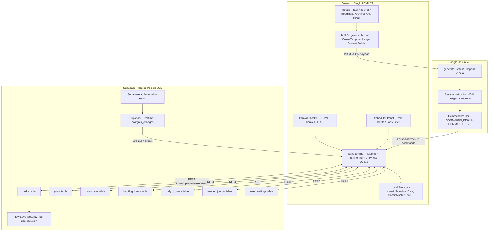

<div align="center">

# ⚔️ 24-Hour Command Center

**A premium, single-file productivity system built for high-performers.**  
Visual 24-hour scheduling · AI-powered task management · Real-time cross-device cloud sync · 30-day performance analytics.

<br/>


<br/>

> *"The ledger is empty. Draw upon the clock face to begin."*

</div>

---

## 📑 Table of Contents

- [Overview](#-overview)
- [Architecture](#-architecture)
- [Core Features](#-core-features)
- [Technology Stack](#-technology-stack)
- [Getting Started](#-getting-started)
  - [Local Usage (Zero Setup)](#local-usage-zero-setup)
  - [Cloud Sync Setup (Supabase)](#cloud-sync-setup-supabase)
  - [AI Advisor Setup (Gemini)](#ai-advisor-setup-gemini)
  - [Hosting on GitHub Pages](#hosting-on-github-pages)
- [Database Schema](#-database-schema)
- [AI System Architecture](#-ai-system-architecture)
- [Data Flow & Sync Strategy](#-data-flow--sync-strategy)
- [Project Structure](#-project-structure)
- [Roadmap](#-roadmap)
- [Performance & Constraints](#-performance--constraints)
- [Known Issues](#-known-issues)
- [Author](#-author)

---

## 🔭 Overview

The **24-Hour Command Center** is a self-contained, zero-dependency productivity application that fits entirely inside a single HTML file. It is designed for high-discipline individuals who need to track every hour of a 24-hour day — not just a standard 9–5 window.

Unlike calendar or to-do list apps, the Command Center uses an **interactive circular clock canvas** as its primary scheduling interface. Tasks are plotted as colored wedges on a 24-hour dial, giving an instant visual representation of how a day is structured.

When connected to [Supabase](https://supabase.com), all data (tasks, goals, journals, milestones, backlog, Gemini API key) syncs in real time across every device the user is signed into. The app remains fully functional in **Local-Only mode** with `localStorage` even without a cloud connection.

The integrated **Drill Sergeant AI Advisor** — powered by Google Gemini — has omniscient read access to your entire task ledger across all dates, and can add or delete tasks on any date via natural language instruction.

---

## 🏛️ Architecture



---

## 🚀 Core Features

### 🕐 Interactive 24-Hour Clock Canvas

| Capability | Detail |
|---|---|
| **Drag-to-schedule** | Click and drag a wedge arc on the clock face to instantly open the task modal with pre-filled start/end times |
| **Colored task wedges** | Each task is rendered as a colored arc segment on the dial |
| **Live time hand** | A red indicator hand shows the current time (only on today's view) |
| **Goal Ink Colors** | Tasks auto-inherit their goal's assigned color across the clock and task list |
| **HiDPI / Retina** | Canvas scales with `window.devicePixelRatio` for sharp rendering on all screens |
| **24h coverage** | Clock covers the full 24-hour day — midnight to midnight |

### 🤖 Drill Sergeant AI Advisor (Gemini-Powered)

| Capability | Detail |
|---|---|
| **Cross-temporal awareness** | AI receives a structured summary of the user's entire task ledger across **all dates** in memory |
| **Natural language scheduling** | Tell the AI to add or delete tasks on any date and it executes them in real-time |
| **Structured command protocol** | AI responses embed JSON command arrays in `===COMMANDS_BEGIN=== / ===COMMANDS_END===` delimiters — parsed and applied client-side |
| **Immediate cloud push** | AI-issued task mutations are pushed to Supabase immediately if cloud is connected |
| **Multi-model support** | Gemini 3.6 Flash, 3.5 Flash-Lite, 3.1 Pro, 2.5 Flash, or any custom model ID |
| **Throttled ledger pull** | Full-history ledger re-fetch is rate-limited to once per 60 seconds to avoid DB overload |
| **Persistent chat memory** | Chat history kept in-session; clearable on demand |

### ☁️ Real-Time Cloud Sync (Supabase)

| Capability | Detail |
|---|---|
| **Supabase Realtime** | Subscribes to `postgres_changes` on all 6 tables — changes push to connected devices within seconds |
| **Fallback polling** | Background sync runs every 45 seconds as a safety net if Realtime is not enabled on the project |
| **Offline resilience** | Detects `navigator.onLine`, marks changes as `_unsynced`, retries automatically on reconnect |
| **Unsynced task queue** | Any task that fails to reach the server is flagged visually and retried on next manual sync |
| **Local-to-cloud migration** | One-click import of all existing `localStorage` data on first cloud sign-in |
| **Session persistence** | Supabase auth token stored in `localStorage` — auto-restores session on revisit |
| **Row Level Security** | Every DB table enforces `auth.uid() = user_id` — users can never access other users' data |

### 📋 Task & Project Management

| Capability | Detail |
|---|---|
| **Rich task model** | Title, time range, goal tag, color, notes, subtasks (JSON), review/retrospective, completion state |
| **Subtask progress bar** | Visual progress bar shows % of subtasks completed |
| **Auto-completion cascade** | Marking all subtasks done auto-marks the parent task complete, and vice versa |
| **Sort modes** | Switch between "Sort by Time" and "Group by Goal" views |
| **Retrospective field** | Per-task post-mortem notes for learning from execution failures |
| **Idea Inbox (Backlog)** | Slide-in drawer to capture unscheduled ideas, link to goals, and promote them to scheduled tasks |

### 📊 Archives & Analytics

| Metric | Description |
|---|---|
| **Hours Planned** | Total scheduled time across last 30 days |
| **Hours Executed** | Total completed task time across last 30 days |
| **Discipline Rate** | `(Executed / Planned) × 100` — your execution efficiency % |
| **Active Days Logged** | Count of days with at least one task in the 30-day window |
| **Effort Intensity Heatmap** | 30-day rolling GitHub-style grid (5 heat levels: 0–2h, 2–5h, 5–8h, 8h+) |
| **Goal Time Allocation** | Hours invested per Master Goal with percentage share |
| **CSV Export** | All tasks, all dates — opens in Excel without encoding issues (BOM-prefixed UTF-8) |
| **JSON Backup** | Full data export: tasks, journals, milestones, backlog, goals, goal colors |
| **Performance Report** | Clipboard-ready plain-text summary for sharing or logging |

---

## 🛠️ Technology Stack

| Layer | Technology | Notes |
|---|---|---|
| **UI Rendering** | HTML5 Canvas 2D API | Clock face, wedge drawing, time hand |
| **Application Logic** | Vanilla JavaScript (ES2022) | No framework, no build step |
| **Styling** | Vanilla CSS + CSS Custom Properties | Parchment/brass design system |
| **Local Persistence** | `localStorage` (with in-memory fallback) | Works offline, no setup |
| **Cloud Database** | Supabase (PostgreSQL) | Hosted, free tier available |
| **Real-Time Sync** | Supabase Realtime (`postgres_changes`) | WebSocket-based live updates |
| **Authentication** | Supabase Auth (email + password) | JWT, auto-refresh, per-user RLS |
| **AI Integration** | Google Gemini API (REST) | `generateContent` v1beta endpoint |
| **Deployment** | Static file (HTML) | GitHub Pages, Netlify, any CDN |

---

## ⚙️ Getting Started

### Local Usage (Zero Setup)

The app requires **no installation, no build step, and no server**.

```bash
# Clone the repository
git clone https://github.com/afrojkhan6033/command_center.git
cd command_center

# Open directly in your browser:
# Windows:
start command-center.html

# macOS:
open command-center.html

# Linux:
xdg-open command-center.html
```

> **Note:** For `localStorage` to persist reliably between sessions, serve the file via a local HTTP server or host it online. The app handles storage unavailability gracefully with an in-memory fallback.

```bash
# Quick local server options:
npx serve .            # Node.js
python -m http.server 8080   # Python 3
```

Then open: `http://localhost:8080/command-center.html`

---

### Cloud Sync Setup (Supabase)

> Full walkthrough is in [`SETUP_GUIDE.md`](./SETUP_GUIDE.md).

**Step 1 — Create a free Supabase project**
1. Go to [supabase.com](https://supabase.com) → Sign up → **New Project**
2. Choose any name and region. Wait ~2 minutes for provisioning.

**Step 2 — Run the database schema**
1. Open **SQL Editor → New Query** in your Supabase dashboard
2. Copy the entire contents of [`schema.sql`](./schema.sql) → paste → **Run**
3. Expected result: `Success. No rows returned.`

**Step 3 — Get your API credentials**
1. Go to **Project Settings → API**
2. Copy the **Project URL** (e.g. `https://xxxxxxxx.supabase.co`)
3. Copy the **anon public key** (starts with `eyJ...`)

**Step 4 — Connect inside the app**
1. Open the app → click **☁ Cloud Sync**
2. Paste the Project URL + anon key → click **Connect**
3. Create an account (email + password) directly in the app
4. If you have existing local data, click **⬆ Import local data to cloud**

---

### AI Advisor Setup (Gemini)

**Step 1 — Get a free Gemini API key**
1. Visit [aistudio.google.com/apikey](https://aistudio.google.com/apikey)
2. Sign in with your Google account → **Create API Key**

**Step 2 — Enter it in the app**
1. Click **🤖 Drill Sergeant AI** → **⚙ Settings**
2. Paste your API key, choose a model → **Save**

**Model options:**

| Model | Best For |
|---|---|
| `gemini-3.6-flash` *(default)* | Best balance of speed and capability |
| `gemini-3.5-flash-lite` | Fastest responses, lowest cost |
| `gemini-3.1-pro` | Strongest multi-step reasoning |
| `gemini-2.5-flash` | Legacy, for compatibility |
| Custom ID | Any Gemini model string |

> **Privacy:** Your API key is stored only in your own browser `localStorage` and optionally in your own Supabase `user_settings` table — never sent anywhere except Google's official API endpoint.

---

### Hosting on GitHub Pages

1. Push the repository to GitHub
2. Go to **Settings → Pages → Source → main branch / root** → **Save**
3. Your app will be live at:
   ```
   https://afrojkhan6033.github.io/command_center/command-center.html
   ```
4. For a cleaner URL, rename `command-center.html` to `index.html`:
   ```
   https://afrojkhan6033.github.io/command_center/
   ```

---

## 🗄️ Database Schema

Seven PostgreSQL tables, all protected by Row Level Security (`auth.uid() = user_id`):

| Table | Purpose | Key Columns |
|---|---|---|
| `tasks` | Scheduled time blocks | `date`, `start_time`, `end_time`, `label`, `goal`, `subtasks (jsonb)` |
| `goals` | Master goals list | `name`, `color` (Goal Ink) |
| `milestones` | Roadmap items per goal | `goal`, `text`, `done`, `sort_order` |
| `backlog_items` | Unscheduled ideas | `label`, `goal`, `notes` |
| `daily_journals` | Per-date journal entries | `(user_id, date)` composite PK |
| `master_journal` | Single long-form strategy doc | `user_id` as PK (one row per user) |
| `user_settings` | Gemini key + model preference | `gemini_api_key`, `gemini_model` |

**Key design decisions:**
- `tasks.subtasks` stored as `jsonb` (`[{ text, done }]`) — avoids a separate join table for what is always a small, bounded list
- `tasks.start_time` / `end_time` stored as `"HH:MM"` strings; converted to/from canvas arc angles client-side
- `user_settings` uses a single-row-per-user `upsert` pattern
- All `updated_at` columns are auto-maintained by a `set_updated_at()` PL/pgSQL trigger function

Full annotated schema: [`schema.sql`](./schema.sql)

---

## 🤖 AI System Architecture

The Drill Sergeant AI uses a **cross-temporal context injection** pattern to give the model full awareness of the user's entire scheduling history:

```
┌──────────────────────────────────────────────────────────────────┐
│                     Gemini API Payload                           │
│                                                                  │
│  system_instruction:                                             │
│    • Persona: military drill sergeant                            │
│    • Current app viewing date                                    │
│    • Actual real-world today's date                              │
│    • User's master goals list                                    │
│    • OMNISCIENT LEDGER: all tasks across all dates (with IDs)   │
│    • Command protocol spec (add/delete JSON block format)        │
│                                                                  │
│  contents: [ ...chat history, { role: user, text } ]            │
└──────────────────────────────────────────────────────────────────┘
                            │
                            ▼ Gemini Response
                ┌───────────┴───────────┐
                │                       │
         Command block?           No commands
    Parse JSON between           Render text in
    COMMANDS_BEGIN delimiters    chat window
                │
        For each command:
    ┌───────────┴───────────┐
    │                       │
  "add" task            "delete" task
  Create locally        Find by ID + date
  Push to Supabase      Remove locally + Supabase
  Re-render UI          Re-render UI
```

---

## 🔄 Data Flow & Sync Strategy

**Local-first, cloud-backed architecture:**

```
WRITE:
  User action
    → localStorage (immediate, synchronous)
    → Supabase REST (async)
         ↓ on failure
         mark task._unsynced = true
         retry on next Sync Now / app reload

READ (on date change):
  Render from localStorage cache immediately
    → Pull from Supabase for selected date
        → Merge (cloud wins, unsynced local tasks preserved)
            → Re-render

REALTIME (while signed in):
  Supabase push → merge into tasksByDate → re-render if date matches
```

**Sync trigger map:**

| Trigger | Action |
|---|---|
| Date change | Pull tasks for the new date |
| Sign in | Full global data pull (goals, milestones, backlog, journals, settings) |
| Manual "Sync Now" | Full pull + unsynced queue retry |
| Task create/edit/delete | Immediate REST push |
| Realtime event | Immediate local merge + conditional re-render |
| Every 45 seconds | Background pull for current date (polling fallback) |
| Open AI modal | Full-history pull — throttled to 1× per 60 seconds |
| Browser back online | Triggers `manualSyncNow()` |

---

## 📁 Project Structure

```
project_sheduler/
│
├── command-center.html   # Entire application — HTML + CSS + JS (~127KB, ~1,985 lines)
├── schema.sql            # Supabase PostgreSQL schema (tables, RLS, Realtime, triggers)
├── SETUP_GUIDE.md        # End-user cloud sync setup walkthrough
└── README.md             # This file
```

The entire app lives in a **single HTML file** intentionally for maximum portability:
- ✅ Open directly from a USB drive or local disk
- ✅ Email as an attachment
- ✅ Host on any static file server (GitHub Pages, Netlify, Vercel)
- ✅ Self-host privately with zero backend infrastructure

---

## 🗺️ Roadmap

| Status | Feature |
|---|---|
| ✅ **Done** | 24-hour canvas clock with drag-to-schedule |
| ✅ **Done** | Supabase cloud sync with Realtime |
| ✅ **Done** | Cross-temporal Drill Sergeant AI (Gemini) |
| ✅ **Done** | Master Goals + Goal Ink color system |
| ✅ **Done** | Subtasks with progress bars |
| ✅ **Done** | Daily + Master Journal |
| ✅ **Done** | Strategic Roadmap with milestones |
| ✅ **Done** | Effort heatmap + performance analytics |
| ✅ **Done** | CSV + JSON export |
| ✅ **Done** | Offline resilience with unsynced queue |
| 🔜 **Planned** | Week view (7-day calendar overlay) |
| 🔜 **Planned** | Recurring tasks (daily/weekly templates) |
| 🔜 **Planned** | Mobile touch support (pinch-zoom clock) |
| 🔜 **Planned** | AI-generated weekly performance summaries |
| 🔜 **Planned** | Dark mode toggle |
| 🔜 **Planned** | Shared workspaces (multi-user collaboration) |
| 🔜 **Planned** | Push notifications (Web Push API) |
| 🔜 **Planned** | Import from Google Calendar |

---

## ⚡ Performance & Constraints

| Metric | Value |
|---|---|
| Bundle size | ~127 KB (single file, no external assets) |
| External CDN dependency | 1 (Supabase JS v2 from jsDelivr) |
| localStorage growth | Linear with task history — safe for years of daily use |
| AI payload size | Grows linearly with task count; Gemini token limits apply at extreme volumes |
| Realtime connections | 1 WebSocket channel per signed-in session |
| Supabase free tier | 500MB DB · 2GB bandwidth/month — sufficient for personal use |
| Gemini free tier | 15 req/min (Flash models) |
| HiDPI support | Full — canvas scales with `devicePixelRatio` |
| Minimum browser | Chrome 88 · Firefox 98 · Edge 88 · Safari 15.4 (for `<dialog>`) |

---

## 🐛 Known Issues

| Issue | Workaround |
|---|---|
| `localStorage` blocked in strict privacy modes | Serve via local HTTP server or host online |
| AI key transmitted client-side | Use a personal key only — key is sent exclusively to Google's official API |
| AI command parsing fails on malformed responses | Clear chat memory and rephrase the request |
| Supabase Realtime disabled by default on new projects | Enable in Dashboard → Database → Replication; 45s polling fallback covers the gap |
| `<dialog>` not supported in Safari < 15.4 | Update Safari or use Chrome / Firefox / Edge |
| CSV date column auto-formatted by Excel | Already handled with `="YYYY-MM-DD"` Excel escape prefix |

---

## 👤 Author

**afrojkhan6033**  
GitHub: [@afrojkhan6033](https://github.com/afrojkhan6033)

---

## ⚠️ License

**All Rights Reserved.**

This software and its source code are the exclusive intellectual property of the author.  
No part of this project may be copied, modified, distributed, sublicensed, or sold without explicit written permission from the author.

---

<div align="center">

Built with precision. Maintained with discipline.

*Command your time — or it will command you.*

</div>
